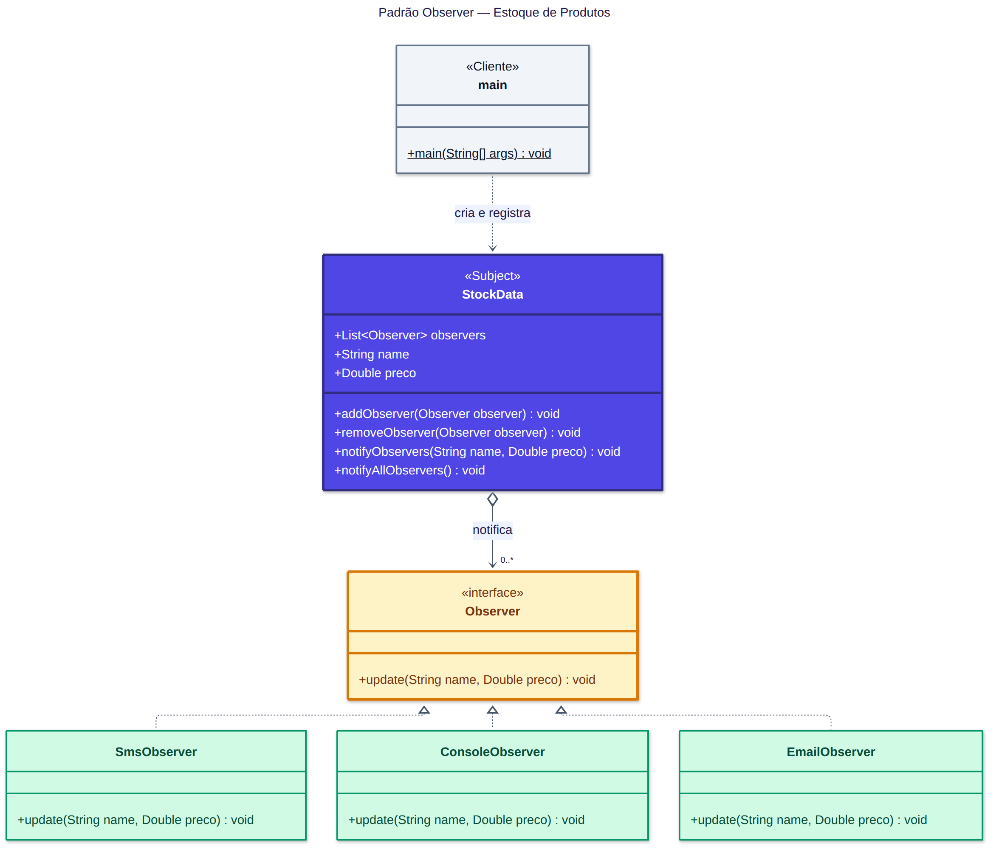
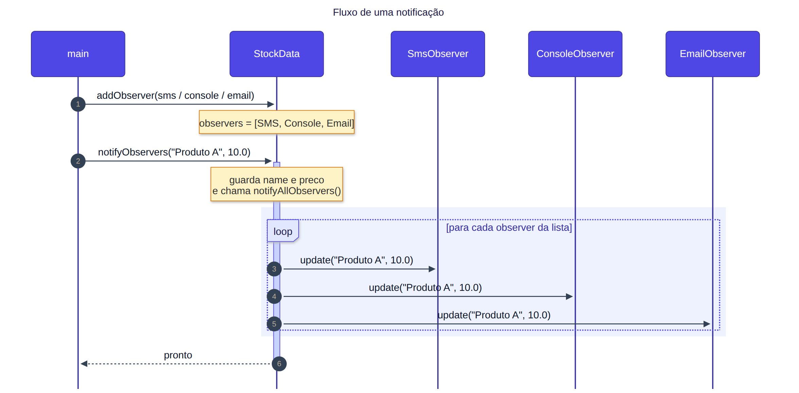
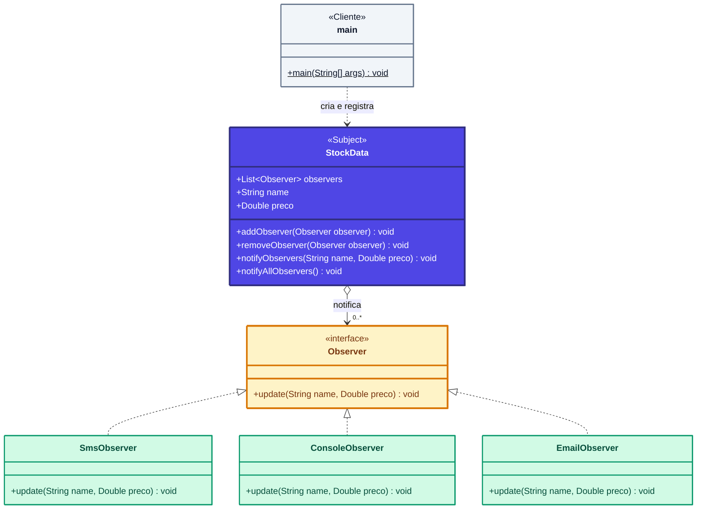
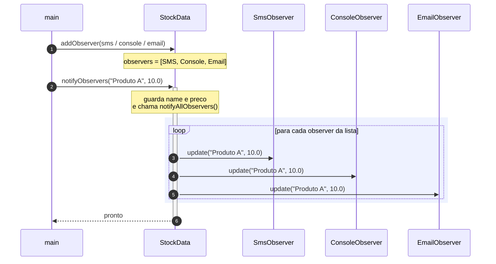

# Padrão Observer: Estoque de Produtos

## Diagrama de classes

| Cor | Papel no padrão | Classe |
|-----|-----------------|--------|
| 🟪 Roxo | **Subject**: guarda a lista e avisa todo mundo | `StockData` |
| 🟨 Amarelo | **Observer**: contrato que todos seguem | `Observer` |
| 🟩 Verde | **Observers concretos**: cada um reage do seu jeito | `SmsObserver`, `ConsoleObserver`, `EmailObserver` |
| ⬜ Cinza | **Cliente**: monta tudo e dispara | `main` |

**Setas:**
- `StockData ◇→ Observer` (0..*): o StockData **tem** uma lista de observers.
- `Observer ◁┈ SmsObserver`: a classe **implementa** a interface.
- `main ┈> StockData`: o main **usa** o StockData.

## Fluxo de uma notificação

1. O `main` registra os 3 observers com `addObserver`.
2. O `main` chama `notifyObservers("Produto A", 10.0)`.
3. O `StockData` guarda nome e preço e percorre a lista chamando `update(...)` em cada observer.

---

Código Mermaid (para editar os diagramas)

